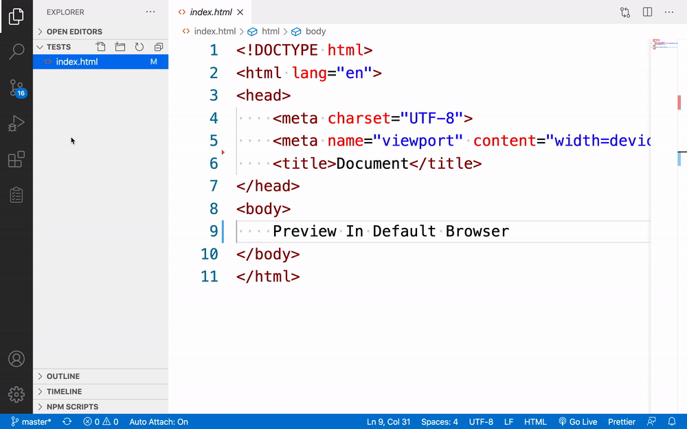

# Open Browser Preview

Preview file in your default browser.

# Context Menu

Select `Preview In Default Browser` in context menu, preview file in browser↓

# Command

1. Press `Ctrl+Shift+P` to open the command list.
2. Select `Preview In Default Browser`.

# Keybindings

1. Press `Ctrl+F1` in win or `Cmd+F1` in mac.

If you think it's useful, you can leave us a [message and like it](https://marketplace.visualstudio.com/items?itemName=Wscats.cors-browser&ssr=false#review-details), Your support is our driving force😀

# License

Open Browser Preview is released under the [MIT](http://opensource.org/licenses/MIT).
